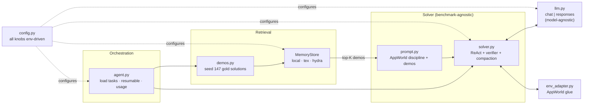

# Arena — an autonomous agent harness for AppWorld

> An autonomous coding agent for the [**AppWorld**](https://github.com/StonyBrookNLP/appworld)
> benchmark, built for the **`://agent_arena`** hackathon. AppWorld is an *interactive
> coding* benchmark: the agent reads a natural-language instruction and acts by writing
> Python that calls ~457 APIs across 9 apps — **one code block per turn**, observing
> `print()` output — until it calls `complete_task`. We score on **Task Goal Completion
> (TGC)**: the percentage of tasks completed *fully and exactly*.

**What's in this repo is the *harness* — a modular, model-agnostic, test-driven scaffold
around a ReAct code-agent.** The contribution is the engineering around the model:
similarity-retrieved gold demos, a verifier turn tuned to AppWorld's strict exact-DB-diff
evaluator, pluggable memory backends behind one interface (local embeddings, Tex, HydraDB),
rolling-summary context compaction, and an anti-overfit evaluation protocol. The absolute
TGC number is model-dependent and the graded model changed three times during the
hackathon, so the harness — not any single score — is the durable artifact.

| | |
|---|---|
| **Tests** | 44 unit tests passing · TDD throughout (`pytest`) |
| **Eval protocol** | leak-free splits (`SEED_SPLITS`) + deterministic held-out slice |
| **Model** | model-agnostic core (OpenAI-compatible chat *and* Azure Responses) |
| **Memory** | pluggable: `local` · `tex` · `hydra` (HydraDB bonus) |
| **Demos** | 147 gold solutions (90 train + 57 dev) retrieved by similarity |

Deep docs: **[Architecture](docs/ARCHITECTURE.md)** · **[Methodology / decision log](docs/METHODOLOGY.md)** · **[Original starter README](docs/STARTER.md)**

---

## Why AppWorld is hard (and what the harness targets)

- **Discovery-dependent.** You don't know the 457 APIs in advance; you discover them at
  runtime (`apis.api_docs.show_api_doc(...)`). You can't pre-plan a task you haven't
  explored (e.g. *"update my playlist per my roommates' messages"* — you must first read
  the messages).
- **One code block per turn.** A ReAct loop: emit Python → environment runs it → you read
  `print()` output → repeat. State persists in the Python namespace across turns.
- **The evaluator is strict.** TGC requires *every* assertion to pass, and it checks
  **exact DB state** — e.g. `changed_model_names() == {"spotify.PlaylistSong"}` plus exact
  added/removed record diffs. **Any stray write to an unrelated table fails the whole
  task.** Precision and "no collateral damage" matter as much as completing the goal.

The harness is shaped by those three facts: the prompt enforces discovery + exact matching
+ minimal mutation; a **verifier turn** re-checks the diff before finalizing; and retrieval
gives the model worked examples without leaking answers.

---

## Architecture at a glance



See **[docs/ARCHITECTURE.md](docs/ARCHITECTURE.md)** for the per-task data-flow and
component diagrams and a layer-by-layer walkthrough.

---

## Results (read the caveats)

> **These are *reference* numbers, not a graded leaderboard result.** They were measured
> on **GPT-5.5**, which was *not* the final graded model (the organizers changed the graded
> model to **Gemini**, after earlier using Groq Llama 3.3 70B). Absolute TGC is
> model-dependent; the harness is the contribution. Treat the numbers below as evidence
> the scaffold *works*, not as a head-to-head leaderboard claim.

| Setting | Split | TGC | Honest caveat |
|---|---|---|---|
| Harness, prompt-discipline fix | `dev` | 79.0 → 100.0 | **Leakage-inflated — not a generalization signal.** Dev tasks come in near-identical sibling variants; seeding *dev* gold while evaluating *dev* lets a task retrieve its sibling's solution ≈ open-book. Both runs measured; only the prompt differs. See [methodology](docs/METHODOLOGY.md). |
| Harness, leak-free (`SEED_SPLITS=train,dev`) | `test_normal` | *preliminary (partial run)* | **Not a final figure.** A run was *in progress* as proof at the time of writing (tracking ~85–90% over the first ~100/168 tasks); official number pending completion. No leakage (test instructions unseen); model = GPT-5.5, **not** the graded model. |

**Leaderboard context** (AppWorld, GPT-4o unless noted) for calibration:

| Approach | TGC |
|---|---|
| Plain ReAct | 48.8 |
| **ReAct + retrieved demos** (best *scaffold-only*) | **68.5** |
| RL-trained SOTA (requires model training) | 86.9 |

The single biggest *scaffold* lever on the public leaderboard is demo retrieval
(+~20 TGC: 48.8 → 68.5, per the published leaderboard). This harness leans on that lever and
adds a verifier plus a fair-A/B-ready pluggable-memory layer. *Caveat:* the verifier's and
memory backends' per-feature impact has **not** yet been A/B-confirmed on the graded model —
only the prompt-discipline change is measured (see [Limitations](#limitations--future-work)).

---

## Quickstart

AppWorld needs **Python 3.11**. The starter `setup.sh` provisions everything.

```bash
bash setup.sh                 # installs uv + py3.11, appworld engine + data, creates .env, verifies
source .venv/bin/activate
```

Fill in **`.env`** (copied from `.env.example`). Never commit it. Keys you may set,
depending on the path you run:

```dotenv
# Model — pick ONE path (see "Swapping models" below)
LLM_API=chat                       # "chat" (OpenAI-compatible) or "responses" (Azure Responses)
MODEL=llama-3.3-70b-versatile
GROQ_API_KEY=...                   # for the chat path (e.g. Groq)
GROQ_BASE_URL=https://api.groq.com/openai/v1
OPENAI_API_KEY=...                 # ALWAYS needed: embeddings go through the OpenAI/Azure client
OPENAI_BASE_URL=...                # for the Azure "responses" path / embeddings

# Optional memory backends
MEMORY_BACKEND=local               # local | tex | hydra
# TEX_API_KEY / TEX_BASE_URL / TEX_ORG_ID / TEX_USER_ID  (tex)
# HYDRADB_API_KEY / HYDRADB_BASE_URL                      (hydra, bonus)
```

**One-command run** (smoke test on 2 dev tasks, then the full split):

```bash
export APPWORLD_EXPERIMENT=team_<yourname>          # unique id
export APPWORLD_DATASET=dev MAX_TASKS=2 && python agent.py     # smoke test
export APPWORLD_DATASET=test_normal MAX_TASKS=0 && python agent.py   # full run
appworld evaluate $APPWORLD_EXPERIMENT $APPWORLD_DATASET        # self-evaluate
```

Runs are **resumable** — re-invoking `python agent.py` skips any task that already produced
output for the experiment, so an interrupted run continues where it left off.
`scripts/run_eval.sh` wraps run + evaluate; `scripts/live_status.py` gives incremental,
cached progress without re-evaluating the whole split.

### Swapping models

The core is **model-agnostic** by design (the graded model changed three times). Two paths,
selected by `LLM_API`:

| `LLM_API` | API | Example model | Set |
|---|---|---|---|
| `chat` | OpenAI-compatible `chat/completions` | Groq Llama 3.3 70B, Gemini (via gateway), local Ollama | `MODEL`, `GROQ_API_KEY`, `GROQ_BASE_URL` |
| `responses` | Azure / OpenAI **Responses API** | GPT-5.5 | `MODEL`, `OPENAI_BASE_URL`, `OPENAI_API_KEY` |

Embeddings (for the `local` memory backend) **always** go through the OpenAI/Azure client
(`text-embedding-3-large`), since not every chat provider offers an embedding API.

### Configuration

Everything is environment-driven via `arena/config.py` — model, API path, dataset, turn
budget, demo count `K_DEMOS`, history compaction `HISTORY_MODE`, observation truncation,
memory backend, and the evaluation `SEED_SPLITS`. No code edits needed to retarget a run.

---

## Tests & quality

```bash
pytest          # 44 unit tests, all passing
```

Built **test-first (TDD)**: the solver loop (verifier transitions, no-code / repeat-code
guards, rolling-summary compaction), the LLM dual-path wrapper, all three memory backends
(with fakes — no network in tests), prompt assembly, demo loading, observation truncation,
and the deterministic split logic are all covered. See `tests/`.

---

## Limitations & future work

- **Numbers are model-dependent and not on the final graded model.** GPT-5.5 reference runs
  demonstrate the scaffold; they are not a leaderboard claim against Gemini.
- **Only the prompt-discipline change is measured; per-feature A/Bs are pending.** The
  held-out protocol and tooling are in place, but the verifier and rolling-summary compaction
  are justified against *observed* failure modes — their clean held-out A/B on the graded
  model is still pending (the mandated Groq free tier's 100K-tokens/day cap blocked it). We
  flag this rather than imply measured gains we don't have.
- **The headline dev number is leakage-inflated** by sibling-variant tasks — we call this
  out explicitly rather than reporting it as generalization. The honest signal is the
  leak-free `test_normal` run.
- **No self-distillation loop yet.** Demos are gold-seeded only; harvesting the agent's own
  passing trajectories back into the memory store is a natural next step.
- **Verifier is a single forced turn.** A multi-pass or DB-diff-aware verifier could catch
  more stray-write failures, at higher token cost.
- **No multi-agent / planner.** Rejected deliberately (see methodology) — discovery-
  dependent tasks and the leaderboard evidence that explicit planning *hurts* on AppWorld.

---

## Attribution

- Benchmark: **AppWorld** — [StonyBrookNLP/appworld](https://github.com/StonyBrookNLP/appworld),
  ACL'24 Best Resource Paper.
- Built for the **`://agent_arena`** hackathon. HydraDB integration targets the event's
  bonus track.
- The original starter template is preserved in **[docs/STARTER.md](docs/STARTER.md)**.
</content>
