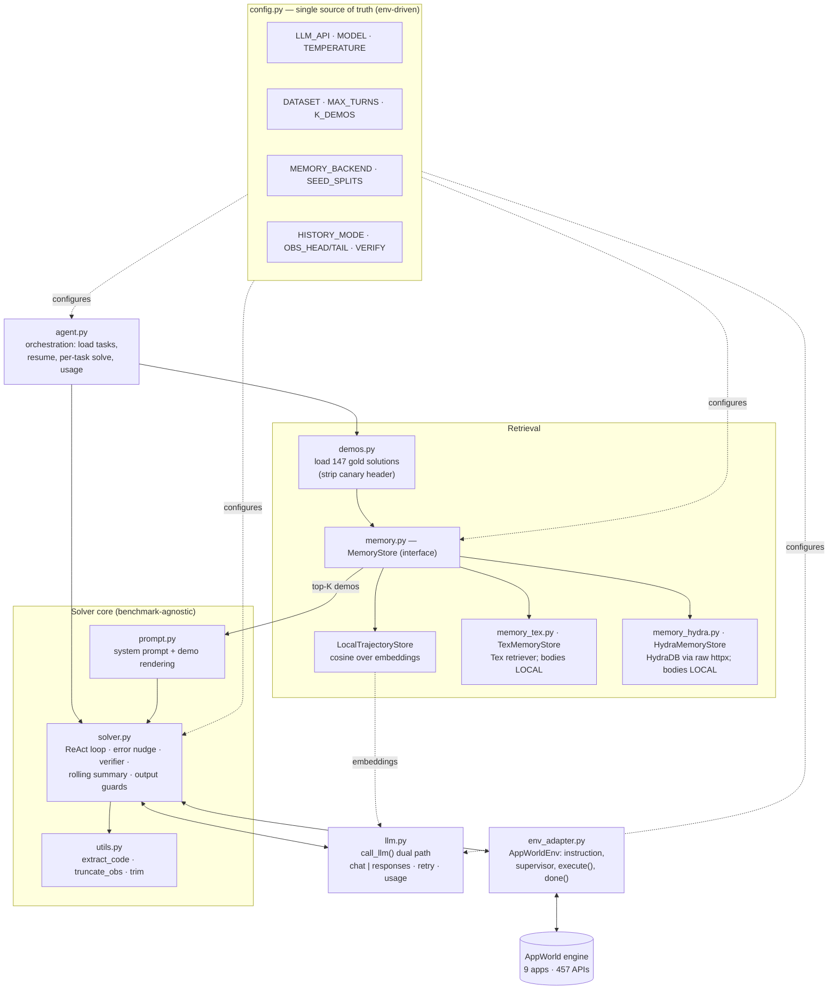

# Architecture

This document walks through every layer of the harness: what it is, why it exists, and how
it works. Two diagrams anchor it — a **per-task data-flow** diagram and a **component**
diagram.

The guiding principle is a **thin AppWorld seam**: only two modules know about AppWorld
(`env_adapter.py` and the orchestration in `agent.py`). The solver loop, prompt, memory, and
LLM wrapper are benchmark-agnostic and individually unit-tested. This was a deliberate
choice (not a multi-benchmark plugin framework — YAGNI for an AppWorld-only scope) that
keeps the loop testable with fakes and the model swappable.

---

## Component diagram



---

## Per-task data flow

```mermaid
sequenceDiagram
    autonumber
    participant A as agent.py
    participant M as MemoryStore
    participant P as prompt.py
    participant S as solver.py
    participant L as llm.py
    participant E as AppWorld env

    A->>M: recall(instruction, k=K_DEMOS, exclude_task_id=tid)
    M-->>A: top-K Demo(s) (instruction + verbatim body)
    A->>P: build_initial_messages(task, demos)
    P-->>S: messages[0] = task + supervisor + reference examples

    loop ReAct turns (until complete_task or MAX_TURNS)
        S->>S: (HISTORY_MODE=summarize) fold OLD observations, keep code+task verbatim
        S->>L: call_llm(messages_to_send, system=SYSTEM_PROMPT)
        L-->>S: assistant reply (one ```python block)
        alt no code block
            S->>S: append no-code nudge, consume turn
        else has code
            S->>E: execute(code)
            E-->>S: observation (print output / traceback)
            S->>S: truncate head+tail; append error nudge if traceback; repeat-code guard
            alt first complete_task call
                S->>S: enter VERIFY phase, inject self-check prompt
            end
        end
    end

    Note over S,E: VERIFY phase: agent re-reads its diff,<br/>may re-call complete_task (overwrites) or print DONE_VERIFIED
    S-->>A: {completed, turns, trajectory}
    A->>A: next task (resumable; token usage tally)
```

---

## Layer-by-layer

### `config.py` — configuration
**What.** One module of environment-overridable knobs with sane dev defaults.
**Why.** Every "smart" feature must be toggleable so we can A/B it on a held-out slice, and
the graded model/dataset changed repeatedly — code edits per run would be error-prone.
**How.** Loads `.env` (via `python-dotenv`, best-effort), then reads env with defaults.
Notable knobs: `LLM_API`, `MODEL`, `TEMPERATURE`; `DATASET`, `MAX_TASKS`, `MAX_TURNS`
(`MAX_INTERACTIONS`); `MEMORY_BACKEND`, `K_DEMOS`, `SEED_SPLITS`; `HISTORY_MODE`,
`MAX_HISTORY_TURNS`, `OBS_HEAD`/`OBS_TAIL`; `VERIFY`. `SEED_SPLITS` is the lever that makes
evaluation leak-free (see [methodology](METHODOLOGY.md)).

### `llm.py` — model-agnostic LLM wrapper
**What.** `call_llm(messages, system=...)` with two backends, selected by `config.LLM_API`.
**Why.** The graded model changed **three times** during the hackathon (GPT-5.5 → Groq Llama
3.3 70B → Gemini). A model-agnostic core meant retargeting was an env change, not a rewrite.
**How.**
- `LLM_API="chat"` → OpenAI-compatible `chat.completions` (Groq, Gemini gateways, local
  Ollama). Built from `GROQ_*`. Uses `temperature` and `max_tokens`.
- `LLM_API="responses"` → Azure/OpenAI **Responses API** (`responses.create`, e.g. GPT-5.5).
  Uses `instructions` + `max_output_tokens`, and auto-doubles the output budget (up to 16k)
  if a response comes back `incomplete`.
- **Embeddings always** go through the OpenAI/Azure client (`_get_client()`), because not
  every chat provider exposes an embedding API; this keeps the `local` memory backend
  working regardless of the chat path.
- Cross-cutting: exponential backoff retries (handles 429 rate limits), and a `USAGE` tally
  (prompt/completion tokens, call count). Thin `_create`/`_create_chat` indirections exist
  so tests can monkeypatch without network.

### `memory.py` + backends — pluggable retrieval
**What.** A `MemoryStore` interface (`add` / `add_many` / `recall(instruction, k,
exclude_task_id)`) with three implementations.
**Why.** Retrieval is the biggest scaffold lever on the leaderboard; making it pluggable lets
us A/B *retrieval quality* across services and integrate HydraDB for the bonus track without
touching the solver.
**How.**
- `LocalTrajectoryStore` — embeds instructions with `text-embedding-3-large` and ranks by
  cosine similarity. The default, dependency-light baseline.
- `TexMemoryStore` (`memory_tex.py`) — uses **Tex by MetaCognition** as a conversational
  memory / semantic retriever. Demos are `remember()`ed concurrently (one call each — a
  single giant batch hangs the API). `TEX_SKIP_INGEST` reuses a pre-ingested session for
  instant startup.
- `HydraMemoryStore` (`memory_hydra.py`) — **HydraDB** via **raw `httpx`**, deliberately
  *not* the `hydradb-sdk`: the SDK pins **pydantic v2**, which conflicts with AppWorld's
  **pydantic v1**. Calls the documented REST API directly (create tenant → wait ready →
  multipart ingest → query), with async-ingest indexing waits.

**Key design — bodies stay local (fair A/B + code fidelity).** External services
(`tex`, `hydra`) index **only the instruction**; the verbatim solution **code ("body")** is
kept **locally** in `_by_key` and re-attached at recall time. A `[[task_id]]` text marker
(and HydraDB metadata) round-trips the id through the service's wrapper so the local body can
be looked up. Two consequences:
1. **Fair A/B.** Every backend returns *identical* demo bodies for the same retrieved
   task_ids, so a comparison isolates *retrieval quality* alone.
2. **Code fidelity.** No external service can summarize/truncate/mangle the solution code —
   the bytes the model sees are exactly the gold solution.

### `demos.py` — the demo bank
**What.** Loads the **147 gold solutions** (90 `train` + 57 `dev`) into the chosen backend.
**Why.** Worked examples of *similar* tasks are the proven +~20 TGC lever; gold solutions are
the highest-quality demos available.
**How.** `load_gold_demos` reads each task's `specs.json` (instruction) and
`ground_truth/solution.py` (body), stripping the canary-string header. `build_seeded_store`
constructs the backend named by `MEMORY_BACKEND` and `add_many`s the demos from
`SEED_SPLITS`. Retrieval is **similarity-only** and always passes `exclude_task_id` so a task
can never retrieve itself.

### `prompt.py` — AppWorld discipline
**What.** A system prompt encoding the rules that win on AppWorld, plus demo rendering into
`messages[0]`.
**Why.** AppWorld's strict exact-DB-diff evaluator punishes the exact failure modes weak
models fall into; the prompt front-loads the discipline.
**How.** The system prompt mandates: exactly one `python` block per turn; **discover APIs at
runtime** (`show_api_doc`); get credentials / per-app access tokens; handle **pagination**;
**inspect before acting** (print a sample record + distinct filter values — a filter matching
zero rows is the #1 cause of empty answers); **don't compute-and-complete in one block**;
**mutate only what's required** (stray writes fail); **never invent API names**; finish only
when verified; **never submit empty/None** for a question; **match output format exactly**.
`build_initial_messages` renders each demo as a *reference example* explicitly framed
"adapt the pattern, do not copy verbatim."

### `solver.py` — the ReAct loop (the heart)
**What.** The turn loop: emit code → execute → observe → reflect → verify → complete.
**Why / How.** Each feature targets a specific, observed failure mode:

- **Error-reflection nudge.** When an observation contains `Traceback`/`Error`/`Exception`,
  append a focused "diagnose the root cause in one line, then output the corrected block"
  instruction. Cheap, and it converts blind retries into directed fixes.
- **Verifier turn.** After the **first** `complete_task`, the loop enters a `verify` phase
  and injects a self-check: *re-read/print what you changed; is the answer non-empty and in
  the exact requested format; did you change ONLY what the task required?* The agent gets up
  to 4 extra turns to **re-call `complete_task`** (verified: it **overwrites**) to fix, or to
  print `DONE_VERIFIED` to confirm. This directly targets both the strict exact-DB-diff eval
  and the dominant weak-model failure (confidently submitting wrong/empty answers).
- **Rolling-summary context compaction** (`HISTORY_MODE="summarize"`, default). Never drops
  a turn. Keeps `messages[0]` (task + demos) and **every assistant CODE block verbatim**;
  only the bulky old **observations** beyond the most recent `MAX_HISTORY_TURNS` are
  condensed (once each, via an injected summarizer). Keeps token cost ~linear on long tasks
  without losing the code history the model needs to reason about its own actions.
  `HISTORY_MODE="full"` re-sends everything.
- **Output-hygiene guards** (for weak models). If a reply has **no code block**, nudge for
  exactly one block instead of executing arbitrary prose. If the model emits **identical code
  to the previous turn**, append a "change approach" nudge (re-read the API doc / change
  inputs).
- **Observation truncation.** `truncate_obs` keeps a head + tail slice (`OBS_HEAD`/
  `OBS_TAIL`), tail-biased to preserve tracebacks and final values.

The loop is fully injectable (`call_llm`, `summarize_fn`, `verify`, `max_turns`) so tests run
it end-to-end with fakes and no network. It returns `{completed, turns, trajectory}`.

### `utils.py` — pure helpers
`extract_code` (last fenced block, with a stripped-text fallback), `has_code_block`,
`truncate_obs`, and `trim_messages` (an alternate hard-trim bounding strategy). All pure and
unit-tested.

### `env_adapter.py` — the AppWorld seam
**What.** `AppWorldEnv`, a context manager exposing exactly what the solver needs:
`instruction`, `supervisor`, `execute(code)`, `done()`.
**Why.** Isolating the only AppWorld-specific surface keeps the solver benchmark-agnostic and
testable. Critically, AppWorld **persists the Python namespace across turns** — a variable
set in turn 1 survives to turn 2 — so the agent holds working state in plain Python variables
(this is why we rejected a separate world-graph subsystem; see methodology).

### `agent.py` — orchestration
**What.** The run driver: load task ids for `DATASET` (optionally capped by `MAX_TASKS`),
build the seeded store, solve each task, tally tokens, print where to evaluate.
**Why / How.** **Resumable** — `_already_done` skips any task that already produced output for
the experiment, so an interrupted long run continues cleanly. Per task it recalls demos
(excluding the task itself), runs `solve`, and logs a compact ✓/✗ line with turns and wall
time. Outputs land in `experiments/outputs/$EXPERIMENT/` for `appworld evaluate`.

### `splits.py` — deterministic held-out slice
`held_out_slice(task_ids, frac=0.3)` sorts task ids by a SHA-1 hash and returns a stable
subset we **never** tune against — the overfit early-warning described in the methodology.

---

## Testing strategy

44 unit tests (`pytest`, `tests/`), written **test-first**. Coverage spans: solver state
machine (verifier enter/fix/confirm, no-code and repeat-code guards, rolling-summary folding,
truncation); the LLM dual-path wrapper and retry/usage accounting (monkeypatched, no
network); all three memory backends (with fake clients / httpx); prompt assembly; gold-demo
loading; and the deterministic split. The injectable solver signature is what makes this
fast and network-free.
</content>
